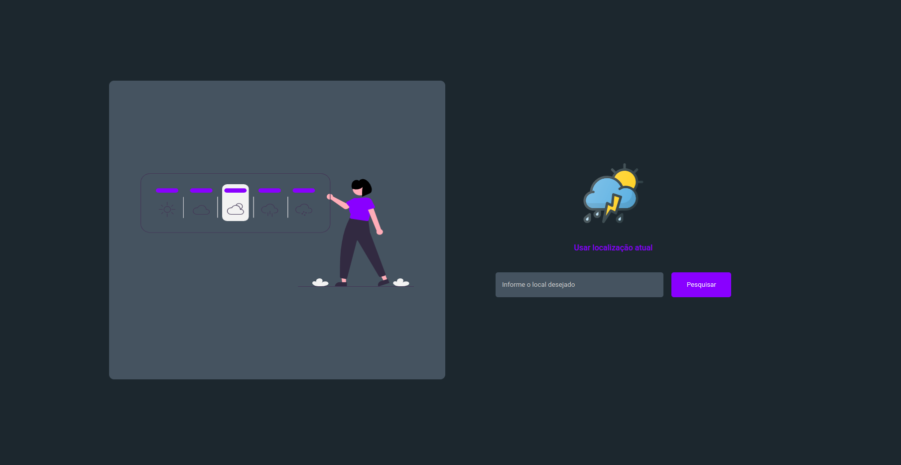
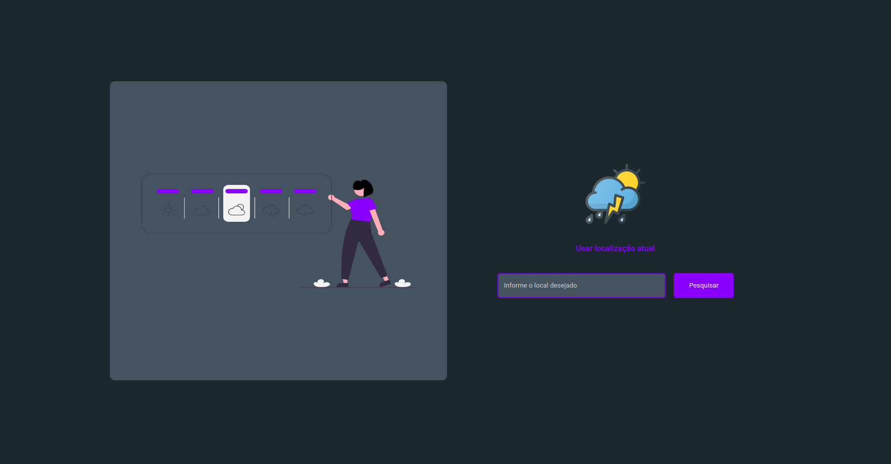
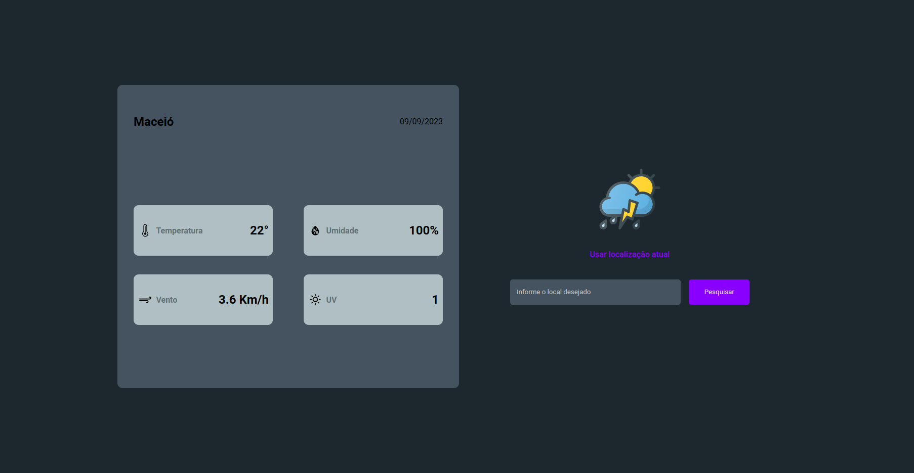

# WEATHER APP

## Descrição
<strong>Weather App</strong> é um website desenvolvido com a finalidade de acessar, de maneira facilitada, a previsão do tempo de determinada localidade.

## Tecnologias utilizadas

<ul>
  <li>React</li>
  <li>Typescript</li>
  <li>Styled Components</li>
  <li>Axios</li>
  <li>entre outras...</li>
</ul>

 

## Executando o Projeto

Para acessar o projeto, clique <a href="https://weather-app-4q5fvghu6-scssilva.vercel.app/">aqui</a>.

## PREVIEW

  

  

 
